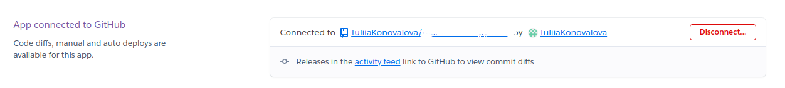

# Deployment

- The app was deployed to [Render](https://render.com/).
- The db was deployed to [MongoDB Atlas](https://www.mongodb.com/cloud/atlas).
- The program can be reached by the [link](https://empowered.onrender.com/).

## To deploy the project as an application that can be **run locally**:

*Note:*
  1. This project requires you to have Python installed on your local PC:
  - `sudo apt install python3`

  1. You will also need pip installed to allow the installation of modules the application uses.
  - `sudo apt install python3-pip`

Create a local copy of the GitHub repository by following one of the two processes below:

- Download ZIP file:
  1. Go to the [GitHub Repository page](https://github.com/AwsSG/empowered).
  1. Click the Code button and download the ZIP file containing the project.
  1. Extract the ZIP file to a location on your PC.

- Clone the repository:
  1. Open a folder on your computer with the terminal.
  1. Run the following command
  - `git clone https://github.com/AwsSG/empowered.git`

- Alternatively, if using Gitpod, you can click below to create your own workspace using this repository.

  

  1. Install Python module dependencies:
     
      1. Navigate to the folder empowered by executing the command:
      - `cd empowered`
      1. Run the command pip install -r requirements.txt
        - `pip3 install -r requirements.txt`

- Create a MongoDB Atlas account if you don't already have one here [MongoDB Atlas](https://www.mongodb.com/cloud/atlas).

- Create a new cluster and database.
- Set up a new user and password for the database.
- Create a new collection called "users" and add the following documents to the collection:
  - `{
    "username": "test",
    "password": "test",
    "email": test@gmail.com"
    }`

- Create a new collection called "tracker" and add the following documents to the collection:
  - `{
    "username": "test",
    "datetime": "(!!!!set to "DATE"!!!!)",
    "emoji": "1",
    "note": "note test"
   }`

- Create a new collection called "resources" and add the following documents to the collection:
  - `{
    "emoji": "1",
    "link": "https://www.google.com/",
    "title": "test link to google",
    }`

- Run the application:
  - `python3 app.py`

### To deploy the project to Heroku so it can be run as a remote web application:
- Clone the repository:
  1. Open a folder on your computer with the terminal.
  1. Run the following command
  - `git clone https://github.com/AwsSG/empowered.git`

  1. Create your own GitHub repository to host the code.
  1. Run the command `git remote set-url origin <Your GitHub Repo Path>` to set the remote repository location to your repository.

  1. Push the files to your repository with the following command:
  `git push`
  1. Create a Heroku account if you don't already have one here [Heroku](https://dashboard.heroku.com).
  1. Create a new Heroku application on the following page here [New Heroku App](https://dashboard.heroku.com/apps):

      - 

  1. Go to the Deploy tab:

      - 

      - 

  1. Link your GitHub account and connect the application to the repository you created.

      - 

  1. Go to the Settings tab:
  
      - 

  1. Click "Add buildpack":

      - 

  1. Add the Python and Node.js buildpacks in the following order:

      - 

  1. Click "Reveal Config Vars."

      - 

  1. Add 1 new Config Vars:
      - Key: PORT Value: 8000
      - *This Config was provided by [CODE INSTITUTE](https://codeinstitute.net/)*.

  1. Go back to the Deploy tab:

      - 

  1. Click "Deploy Branch":

      - 

      - Wait for the completion of the deployment.

      - 

  1. Click "Open app" to launch the application inside a web page.

      - 
