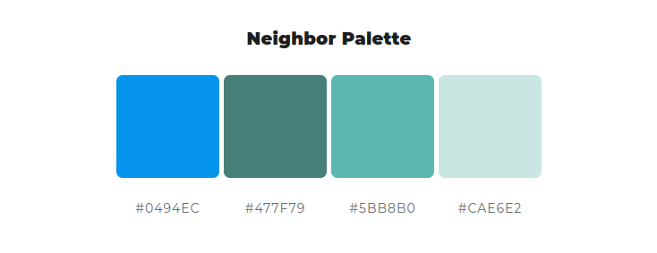
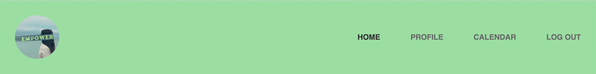
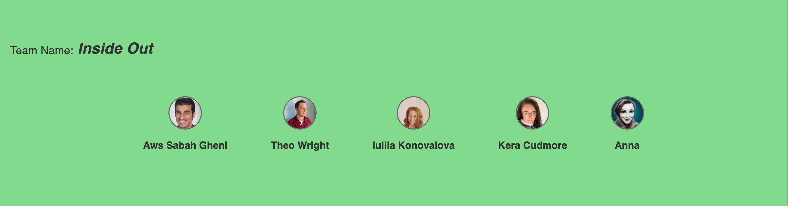

# Empowered

Empowered was developed as part of the January 2022 Hackathon: Accelerating the future of workforce well-being and mindfulness
- presented by Code Institute and Soda Social.

Add site responsive screenshot here

[Click Here to view the deployed site.](https://empowere.herokuapp.com/)


Is there a relevent shield for python? any others that need adding?

## CONTENTS

* [User Experience (UX)](#User-Experience-(UX))
  * [Initial Discussion](#Initial-Discussion)
  * [User Stories](#User-Stories)

* [Design](#Design)
  * [Colour Scheme](#Colour-Scheme)
  * [Typography](#Typography)
  * [Imagery](#Imagery)
  * [Wireframes](#Wireframes)
  * [Features](#Features)
  * [Accessibility](#Accessibility)

* [Technologies Used](#Technologies-Used)
  * [Languages Used](#Languages-Used)
  * [Frameworks, Libraries & Programs Used](#Frameworks,-Libraries-&-Programs-Used)

* [Deployment & Local Development](#Deployment-&-Local-Development)
  * [Deployment](#Deployment)
  * [Local Development](#Local-Development)
    * [How to Fork](#How-to-Fork)
    * [How to Clone](#How-to-Clone)

* [Testing](#Testing)
  
* [Credits](#Credits)
  * [Code Used](#Code-Used)
  * [Content](#Content)
  * [Media](#Media)
  * [Collaborators](#Collaborators)
  * [Acknowledgments](#Acknowledgments)

- - -

## User Experience (UX)

### Initial Discussion

The theme brief for the January 2022 Hackathon was to rethink solutions to help build an iniative to improve different aspects of mental health and well-being in 2022.

The judging criteria:

* Provides a clear and substantial value to the user. 
* Uses an original or innovative idea, design or implementation.
* Has well structured and completed documentation (README and wireframes).
* Is well planned and executed using GitHub projects.
* Focus is realistic and has an overall sense of completeness. 

#### Key information for the site

We discussed several ideas for our project and decided to create a site that would allow the user to record their emotional state daily by choosing the emoji that best depicts how they are feeling. The user would also be able to add a journal entry to expand on their choice of emoji and to note anything they feel is having an effect on their mental health. 

Users would then be able to view their previous emojis on a calendar which would allow them to track their well-being. It would also be a useful tool to be able to show to professionals should the user decide to seek further help. When the user selects an emoji logged in the calendar they would then be shown their journal entry for that day. 

As this would be quite personal information it was important that the user be able to make a profile to keep this information private. By registering a profile the user would then be able to utilise the calendar feature.

When a user selects their emoji we will then provide a personalised recommendation for them based off of the selection they have made. So for example if a user is feeling sad they may be recommended a funny video clip or a positive affirmation, if they are feeling stressed they may receive a video on breathing techniques used to relax or a fun game to play to allow them to destress. 

### User Stories


1. As a user I want to be able to easily find out what the site does.
2. As a user I want to ensure that my personal information (login details and feelings log) will be kept secure and private.
3. As a user I want to be able to choose an appropriate emoticon to select as my emotional status for that day.
4. As a user I would like to be able to add additional notes to my emoticon to allow me to express my state of mind.
5. As a user I want to be able to view my previous emoticons and notes over a selected time frame to get an overview of my mental health.

- - -

## Design

### Colour Scheme



We researched colour theory and colour psychology to find what colour palettes may be beneficial to someone who may be struggling with their mental health. We discovered that light blues are associated with peace, sincerity and gentleness. Darker blues are representative of power, strength and dependability. Greens are associated with growth and have a calming presence.  

We feel that this colour palette has a nice balance between the blues and greens to promote calm and peacefulness on the site. The choice of green also ties in with the use of the colour green in the mental health awareness ribbon.

[Psychology of Color Explained](https://www.masterclass.com/articles/psychology-of-color-explained#4-examples-of-color-psychology)
 | [Colour Psychology - Green](https://www.verywellmind.com/color-psychology-green-2795817) | [Colour Psychology - Blue](https://www.verywellmind.com/the-color-psychology-of-blue-2795815)

### Typography

We have used sans-serif as our font.

### Imagery

### Wireframes

Wireframes were created for mobile, tablet and desktop.


### Features

The website is comprised of a home page, a log in page, a registration page, a profile page and a calendar page. Each page of the site has been designed to be fully responsive on a range of devices.

* All Pages on the website have:
  * A navigation bar which allows the user to navigate to the home page from every page on the website, and other navigational links.
  
  * A footer which contains the hackathon team name and images of the team which link to their GitHub accounts.
  

* Future Implementations.
  * In future implementations we would like to provide the option for a user to be able to change their password or choose to delete their account completely. Due to the time constraints of the Hackathon, this was not a feature required to reach a minimum viable project.

### Accessibility

We have been mindful during coding to ensure that the website is as accessible friendly as possible. This has been have achieved by:

* Using semantic HTML.
* Using descriptive alt attributes on images on the site.
* Ensuring that there is a sufficient colour contrast throughout the site.

- - -

## Technologies Used

### Languages Used

HTML, CSS, Python

### Frameworks, Libraries & Programs Used

Balsamiq - Used to create wireframes.

Git - For version control.

Github - To save and store the files for the website.

Flask 

Mongo DB 

? Font Awesome - For the iconography on the website.

Google Dev Tools - To troubleshoot and test features, solve issues with responsiveness and styling.

[Tiny PNG](https://tinypng.com/) To compress images.

[Favicon.io](https://favicon.io/) To create favicon.

[Am I Responsive?](http://ami.responsivedesign.is/) To show the website image on a range of devices.

[Shields.io](https://shields.io/) To add badges to the README.

[Canva](https://www.canva.com/) To edit images.

- - -

## Deployment & Local Development

### Deployment

The site is deployed using Heroku.

### Local Development

#### How to Fork

To fork the empowered repository:

1. Log in (or sign up) to Github.
2. Go to the repository for this project, AwsSG/empowered.
3. Click the Fork button in the top right corner.

#### How to Clone

To clone the empowered repository:

1. Log in (or sign up) to GitHub.
2. Go to the repository for this project, AwsSG/empowered.
3. Click on the code button, select whether you would like to clone with HTTPS, SSH or GitHub CLI and copy the link shown.
4. Open the terminal in your code editor and change the current working directory to the location you want to use for the cloned directory.
5. Type 'git clone' into the terminal and then paste the link you copied in step 3. Press enter.

- - -

## Testing

[Click Here](TESTING.md) to view the full testing steps that were completed on every device and browser.
### Solved Bugs

1. The cal-heatmap did not displayed data from mongoDB.

    *Solution:* Add additional code to calendar.html as the extension of calendar.js to transform the data to required format:

    ```javascript

        let data222 = {};
        let date0;
        let emoji_number;

        

        date0 = {{ emoji.datetime }}
        emoji_number = {{ emoji.emoji }}
        data222[`${date0}`] = emoji_number
        console.log(data222)

        

        console.log(dataArray)
    ```

1. The didn't represent the data of notes when clicking  on the day:

    *Solution:* Add code to calendar.html and calendar.js in order to connect data

      ```javascript
      let date0;
      let dataArray = []
      let emoji_number;
      let tempDate;


      
      tempDate = new Date({{ emoji.datetime }} * 1000)
      dataArray.push({
        date: tempDate.toLocaleDateString("en-US"),
        emoji: {{ emoji.emoji }},
        note: "{{ emoji.note }}"
      })
      

      console.log(dataArray)
      ```

### Known Bugs

1. The cal-heatmap calendar is not responsive. There for the user can find it a bit messy, but to reduce misleading for the user, the navigation buttons were implemented

1. The user can only use select - options to pick an emoji as flask can retrieve data of value only from input, select when options are implemented.

### Lighthouse

We used Lighthouse within the Chrome Developer Tools to allow us to test the performance, accessibility, best practices and SEO of the website.

### Full Testing

To fully test my website we performed the following testing using a number of browsers (Google Chrome, Safari, Firefox, Brave) and devices (Macbook Pro 14 inch, iPhone 13 pro, …).

We also went through each page using Google Chrome developer tools to ensure that they responsive on all different screen sizes.

- - -

## Credits

### Code Used

### Content

### Media

* [Hero image for home page](https://www.rawpixel.com/image/2303032/free-illustration-vector-mental-health-self-love-meditation)
* [emojis on the hero image](https://www.canva.com/)
* [Logo image](https://www.rawpixel.com/image/3282346/free-photo-image-mental-health-woman-tiredness)
* All team images used in footer belong to the respective team member.

### Collaborators

Team Inside Out members of the January Hackathon 2022:

* [Iuliia Konovalova](https://github.com/IuliiaKonovalova)
* [Aws Sabah Gheni](https://github.com/AwsSG)
* [Theo Wright](https://github.com/theopmw)
* [Kera Cudmore](https://github.com/kera-cudmore)
* [Anna](https://github.com/ANNAhabANNA)

### Acknowledgments

We would like to acknowledge the following people who helped us along the way in completing this project:

* [Dave Bowers](https://github.com/dnlbowers), our hackathon facilitator.
* Our families - for their patience and support while we disappeared for another long weekend of coding.
