# Empowered

Empowered was developed as part of the January 2022 Hackathon: Accelerating the future of workforce well-being and mindfulness, presented by Code Institute and Soda Social.

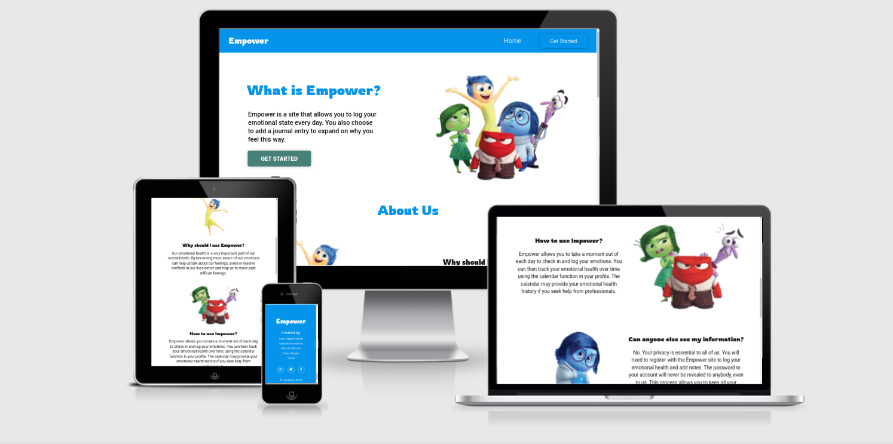

[Click Here to view the deployed site!](https://empowered.onrender.com/)


## CONTENTS

* [User Experience (UX)](#User-Experience-(UX))
  * [Initial Discussion](#Initial-Discussion)
  * [User Stories](#User-Stories)

* [Design](#Design)
  * [Colour Scheme](#Colour-Scheme)
  * [Typography](#Typography)
  * [Imagery](#Imagery)
  * [Wireframes](#Wireframes)
  * [Features](#Features)
  * [Accessibility](#Accessibility)

* [Technologies Used](#Technologies-Used)
  * [Languages Used](#Languages-Used)
  * [Frameworks, Libraries & Programs Used](#Frameworks,-Libraries-&-Programs-Used)

* [Deployment & Local Development](#Deployment-&-Local-Development)
* [Testing](#Testing)  
* [Credits](#Credits)
* [Collaborators](#Collaborators)
* [Acknowledgments](#Acknowledgments)

- - -

## User Experience (UX)

### Initial Discussion

The theme brief for the January 2022 Hackathon was to rethink solutions to help build an iniative to improve different aspects of mental health and well-being in 2022.

The judging criteria:

* Provides a clear and substantial value to the user. 
* Uses an original or innovative idea, design or implementation.
* Has well structured and completed documentation (README and wireframes).
* Is well planned and executed using GitHub projects.
* Focus is realistic and has an overall sense of completeness. 

#### Key information for the site

We discussed several ideas for our project and decided to create a site that would allow the user to record their emotional state daily by choosing the emoji that best depicts how they are feeling. The user would also be able to add a journal entry to expand on their choice of emoji and to note anything they feel is having an effect on their mental health. 

Users would then be able to view their previous emojis on a calendar which would allow them to track their well-being. It would also be a useful tool to be able to show to professionals should the user decide to seek further help. When the user selects an emoji logged in the calendar they would then be shown their journal entry for that day. 

As this would be quite personal information it was important that the user be able to make a profile to keep this information private. By registering a profile the user would then be able to utilise the calendar feature.

When a user selects their emoji we will then provide a personalised recommendation for them based off of the selection they have made. So for example if a user is feeling sad they may be recommended a funny video clip or a positive affirmation, if they are feeling stressed they may receive a video on breathing techniques used to relax or a fun game to play to allow them to destress. 

### User Stories
#### First Time Visitor Goals:

1. As a **First Time Visitor**, I want to **easily understand the main purpose of the website**, so I can **learn more about this website**.

1. As a **First Time Visitor**, I want to **be able to easily navigate through the website**, so I can **find the content**.

1. As a **First Time Visitor**, I want to be able to **register my account**, so I can **learn benefits of the website as a user**.

1. As a **First Time Visitor**, I want to **find the website useful**, so I can **use it according to my needs**.

#### Registered User Goals:

1. As a **Registered User**, I want to **be able to log in to my account**, so I can **have a personal account**.

1. As a **Registered User**, I want to **be able easily login and logout**, so I can **access my personal account information**.

1. As a **Registered User**, I want to **be able to view my profile**, so I can **see my personal information**.

1. As a **Registered User**, I want to **be able to choose an appropriate emoticon to select as my emotional status for that day**, so I can **evaluate my emotions for a day**.

1. As a **Registered User**, I want to **be able to add additional notes to my emoticon to allow me to express my state of mind**, so I can **understand why I felt so over time**.

1. As a **Registered User**, I want to **be able to view my previous emotions**, so I can **evaluate my emotions over time**.

1. As a **Registered User**, I want to **be able to view my journal entries**, so I can **see my daily entries**.

1. As a **Registered User**, I want to **be able to view my calendar**, so I can **see my daily entries**.

1. As a **Registered User**, I want to **be able to view my recommendations**, so I can **see my daily entries**.

---

## Strategy

Developed for those who wish to make track their emotional status over time and learn how to control their feelings.

At present, the site is provided with a calendar and a recommendation system. The calendar allows the user to view their previous emotions and the recommendation system allows the user to see a recommendation based on their current emotional state.

Potential advertisers are encouraged to get in touch to offer their articles and service as long as it is in line of sites main idea to serve people as a platform to record, track, and control their feelings.

---

## Design

### Colour Scheme

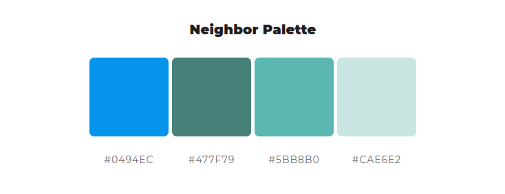

The main design of the website is based on the colour scheme of the website. The colour scheme is based on the colour scheme of the 2015 American computer-animated film: [Inside Out](https://www.imdb.com/title/tt2096673/) since this file was fundamentally based on 5 core emotions that people may experience in their lives. Therefore, we made a choice not only to use the colours of the film but also to use the images of the main characters of the film.

*More information on this movie you can find on [wikipedia](https://en.wikipedia.org/wiki/Inside_Out_(2015_film))*

Moreover, we researched colour theory and colour psychology to find what colour palettes may be beneficial to someone who may be struggling with their mental health. We discovered that blue are associated with peace, sincerity and gentleness. Darker blues are representative of power, strength and dependability. Greens are associated with growth and have a calming presence.  

We feel that this colour palette has a nice balance between the blues and greens to promote calm and peacefulness on the site. The choice of green also ties in with the use of the colour green in the mental health awareness ribbon.

[Psychology of Color Explained](https://www.masterclass.com/articles/psychology-of-color-explained#4-examples-of-color-psychology)
 | [Colour Psychology - Green](https://www.verywellmind.com/color-psychology-green-2795817) | [Colour Psychology - Blue](https://www.verywellmind.com/the-color-psychology-of-blue-2795815)

### Typography

[Main Font: Roboto](https://fonts.google.com/#main-content)

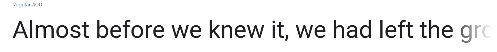

- Roboto Google Font was used as the main font of the website in order to increase readability of the content on the pages.

[Accent Font: Rowdies](https://fonts.google.com/specimen/Rowdies?query=rowd)

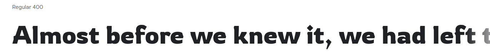

- Rowdies Google Font was used to attract viewers' attention to the company's logo, to make an accent on the strong points of the website, and to incentivize visitors to use our website on a regular basis.

### Imagery

### Wireframes

Wireframes were created for mobile, tablet and desktop.


### Features

The website is comprised of a home page, a log in page, a registration page, a profile page and a calendar page. Each page of the site has been designed to be fully responsive on a range of devices.

* All Pages on the website have:
  * A navigation bar which allows the user to navigate to the home page from every page on the website, and other navigational links.
    - If the user is not logged in, the navigation bar will only have a logo, link to the home page, and get started button.
    
    - if the user clicks on the get started button, they will see a dropdown menu with 2 options: log in or register. After clicking on on of the options, the user will be redirected to the appropriate page.
    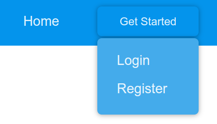
    - When the user is logged in, the navigation bar will have a logo, a profile button, a calendar button, a log out button, and a link to the home page. After clicking on on of the options, the user will be redirected to the appropriate page.
    
    - On the mobile version of the website, the navigation bar will have a hamburger menu icon which will allow the user to see the navigation options.
    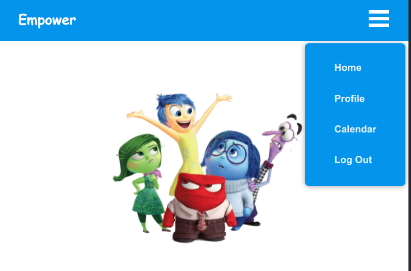
  * A footer which contains logo, the hackathon team members, references to 2022 January Hackathon, link to the repository, and social links.
  
    - On the mobile version of the website, the footer will have a following look:
    

* **Home Page**
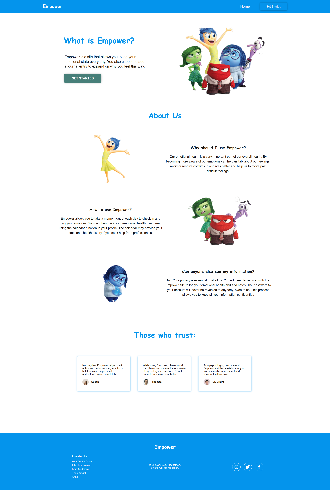
The home page has:
  * HeroSection, which contains: A welcome incentivizing message which shortly explains why this website is essential for a user with a button "GET STARTED", which leads to registration page. It also has an image of the Inside Out emotional characters to welcome users' emotions.
  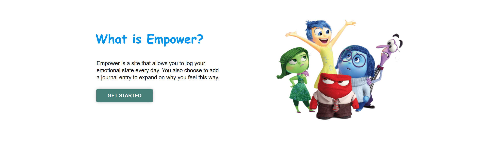
  * About section, which contains a thorough information on the benefits of using this website constantly. It has to section:
    - "Why should I use Empower", which explains why this website is essential for a user wo cope with their emotions.
    - "How can I use Empower", which explains how to use this website on a daily basis and how to withdraw benefits form the website in a long run.
    - "Can anyone else see my information?", which explains that user's privacy is crucial for us and user's data will never be reviewed be anybody, including the creators of the website.
  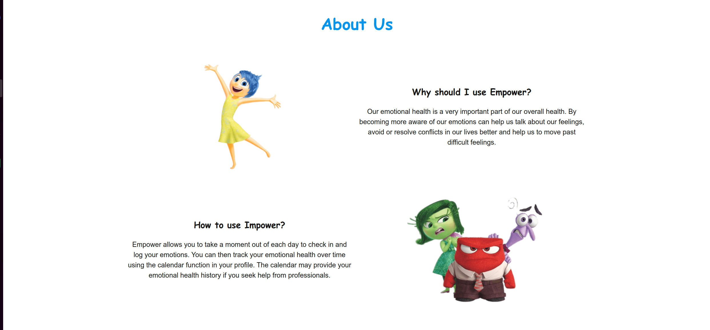
  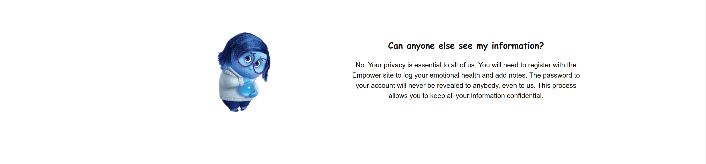
  * Testimonials section, which contains a list of testimonials from users who have used Empower to improve their mental health and show the benefits that other people can get from this website.
  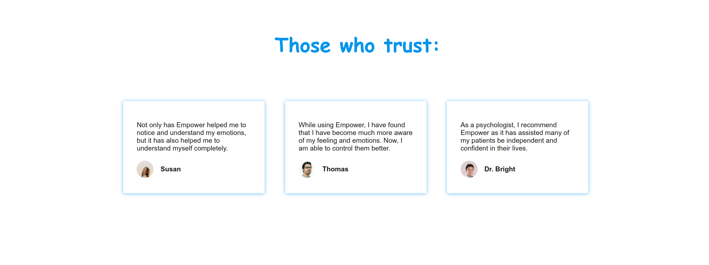

* **Registration Page**

Registration Page has a form which allows the user to register for the website and message explaining how to become a suer as well as reassuring a suer that their privacy would be protected.
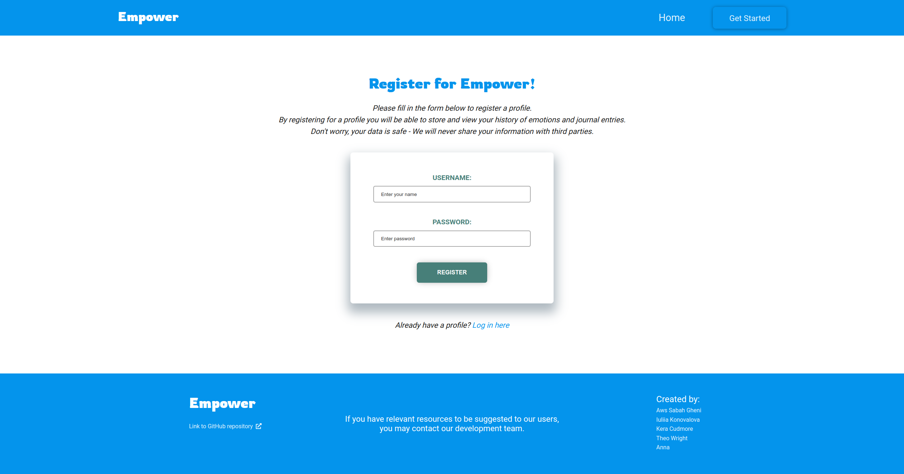

* If the user inputs unsafe username or password, they will see the errors in order to increase user's safety:
  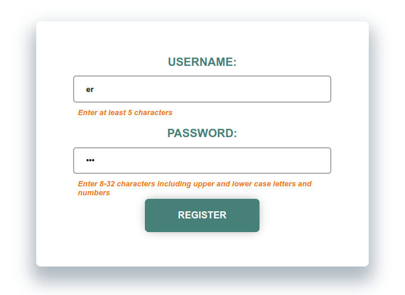

* **Login Page**
Login Page has a form which allows the user to log in to the website.
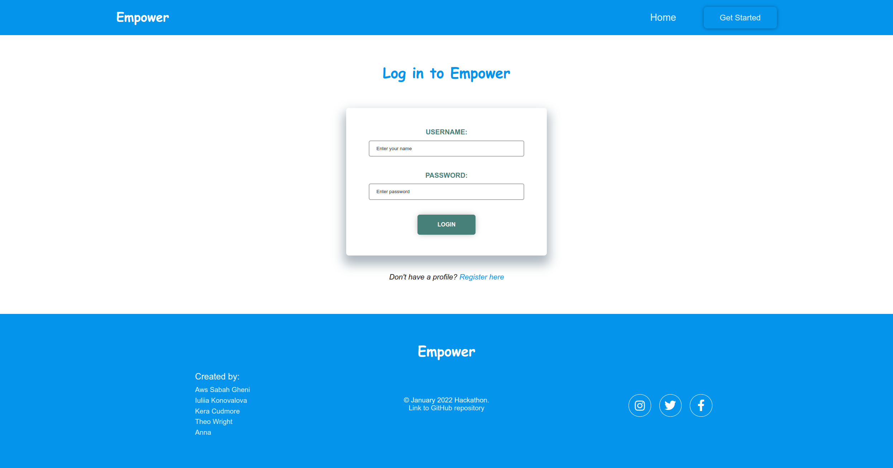

* If the user inputs unsafe username or password, they will see the errors in order to increase user's safety:

* **Profile Page**
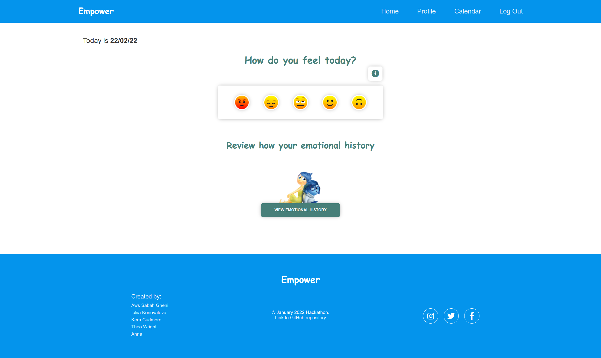
Profile Page consists:
  - a date in the top left corner to remind the user which day is today and which day they are about to evaluate.
  - a range of emojis to indicate the user's mood.
  - an info button, which will show the instructions on the emojis. When the user clicks on the info button it will open a modal window with instructions on how to use the emojis.
  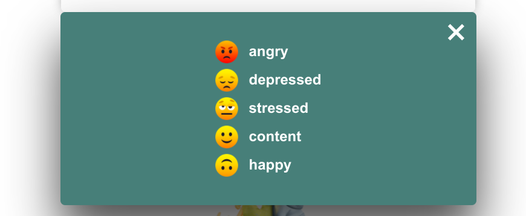.
  - Modal will be closed when the user clicks on the X button or outside of the modal window.
  - It also contains a section with image and a button, which leads to the calendar page.
  - When the user clicks on the chosen emoji, the user will note area, where he or she can add addition notes.
  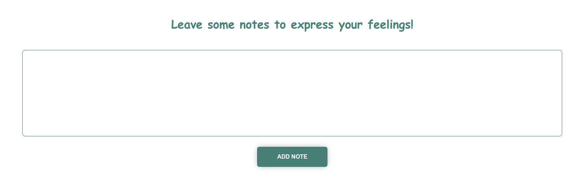
  - The user may also choose not to add a note by leaving textarea empty and clicking on the note button to confirm the entry.
  - When the suer submits their entries for a day, the suggestion box will appear. There will be some suggestions for a user to watch, read, or listen to according to the emotions that the user entered for a day.
  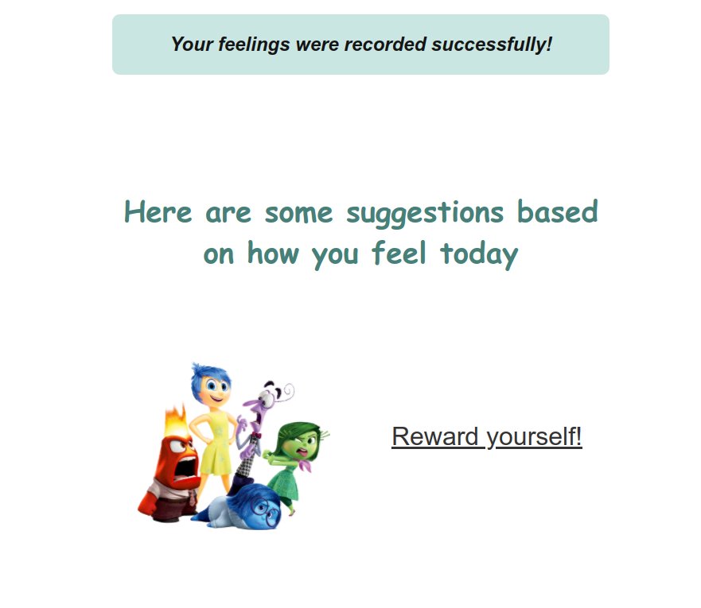

* **Calendar Page**
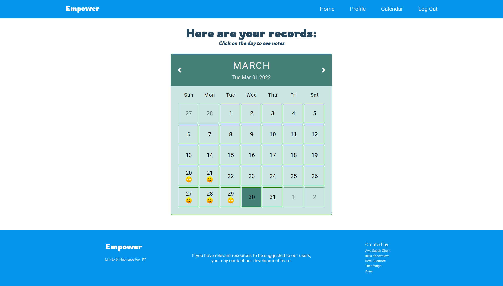
Calendar page consist:
- Heading with a short instruction on how to use the calendar page.
- A calendar with the days of the month.
- 2 buttons to navigate to the previous and next month.
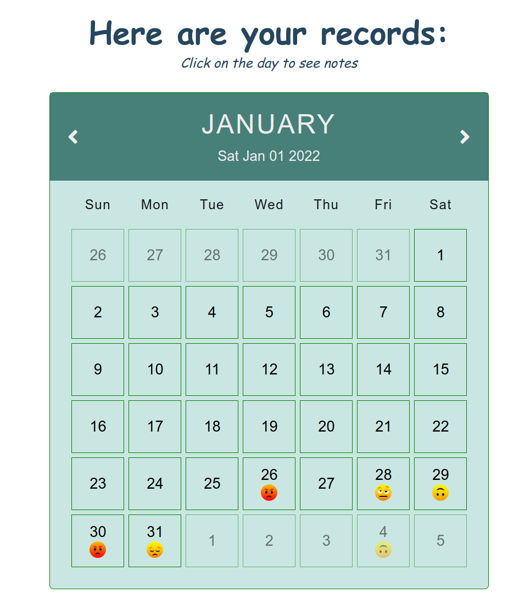
- A note box. When the user click on a day with emoji, the note box will appear, and the user may see the previous entries with emoji.
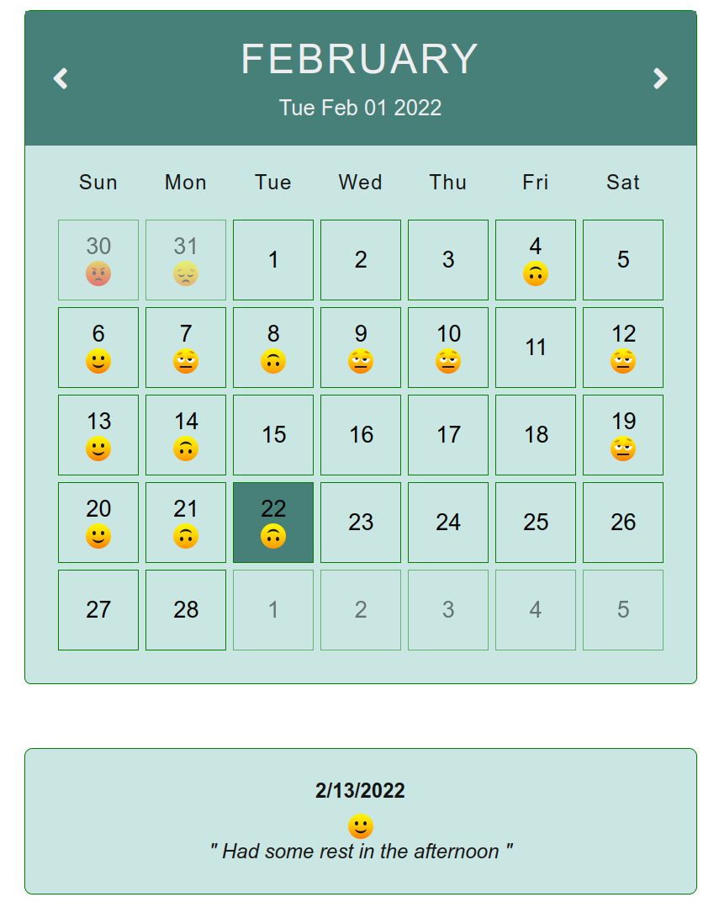
- If the user didn't left any notes, the user will see a day, emoji, message "You didn't left any notes this day".
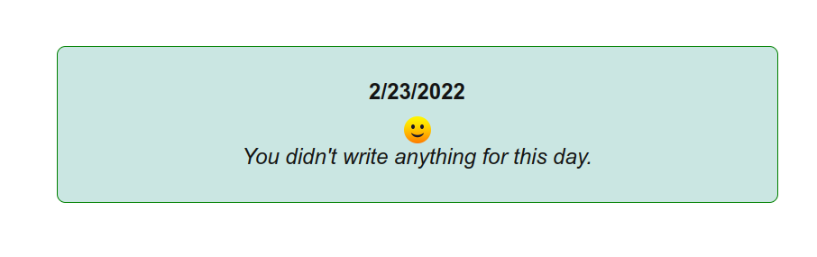

* Future Implementations.
  * In future implementations we would like to provide the option for a user to be able to change their password or choose to delete their account completely. Moreover, we would love companies to take part of our project to participate in providing high quality suggestions to our users in order to improve their mood and feelings.

---
### Accessibility

We have been mindful during coding to ensure that the website is as accessible friendly as possible. This has been have achieved by:

* Using semantic HTML.
* Using descriptive alt attributes on images on the site.
* Ensuring that there is a sufficient colour contrast throughout the site.

---

## Technologies Used

### Languages Used

- [HTML](https://developer.mozilla.org/en-US/docs/Web/HTML) - was used as markdown language.
- [CSS](https://developer.mozilla.org/en-US/docs/Web/css) - was used to add the styles and layout of the site.
- [Python 3.8.5](https://www.python.org/downloads/release/python-385/) - used to manipulate the data.


### Frameworks, Libraries & Programs Used, etc

- [Flask](https://flask.palletsprojects.com/en/2.0.x/) was used as the foundation of the site.
- [CSS Flexbox](https://developer.mozilla.org/en-US/docs/Learn/CSS/CSS_layout/Flexbox) - was used to arrange items simmetrically on the pages.
- [CSS roots](https://developer.mozilla.org/en-US/docs/Web/CSS/:root) - was used to declaring global CSS variables and apply them throughout the project. 
- [Balsamiq](https://balsamiq.com/) - was used to make wireframes for the website.
- [VSCode](https://code.visualstudio.com/) - was used as the main tool to write and edit code.
- [Git](https://git-scm.com/) - was used for the version control of the website.
- [GitHub](https://github.com/) - was used to host the code of the website.
- [GIMP](https://www.gimp.org/) - was used to make and resize images for the README file.
- [Mongo DB](https://www.mongodb.com/) - was used to store the data.
- [Chrome DevTools](https://developer.chrome.com/docs/devtools/open/): was used to debug the website.
- [Tiny PNG](https://tinypng.com/) To compress images.
- [Favicon.io](https://favicon.io/) To create favicon.
- [Am I Responsive?](http://ami.responsivedesign.is/) To show the website image on a range of devices.
- [Shields.io](https://shields.io/) To add badges to the README.
- [Render](https://render.com/) To deploy the website.

---
## Deployment 

- The app was deployed to [Render](https://render.com/).
- The db was deployed to [MongoDB Atlas](https://www.mongodb.com/cloud/atlas).
- The program can be reached by the [link](https://empowered.onrender.com/).

[Click Here](DEPLOYMENT.md) to view the full DEPLOYMENT STEPS that were completed on every device and browser.

---
## Testing

[Click Here](TESTING.md) to view the full testing steps that were completed on every device and browser.

---

## Bugs
### Solved Bugs

1. The calendar didn't represent the data of notes when clicking  on the day:

    *Solution:* Add code to calendar.html and calendar.js in order to connect data

      ```javascript
      let dataArray = []
      let emoji_number;
      let tempDate;


      
      tempDate = new Date({{ emoji.datetime }} * 1000)
      dataArray.push({
        date: tempDate.toLocaleDateString("en-US"),
        emoji: {{ emoji.emoji }},
        note: "{{ emoji.note }}"
      })
      

      console.log(dataArray)
      ```

1. The babble js functionality didn't work: while clicking on the day number or emoji in the calendar, the 'click' eventListener didn't work.

    *Solution:* Add if statement to target children elements through parent element.

      ```javascript
      if (item.date === e.target.closest("div").dataset.day ||
          item.date === e.target.parentElement.parentElement.dataset.day ||
          item.date === e.target.parentElement.dataset.day
      )

1. Notes notes in the calendar didn't disappear if the user clicked on the day without entries recorded:

    *Solution:* Add code to calendar.html: variable "entriesDates" to store the dates of entries and if statement to check if the date is in the array.

      ```javascript
        if (entriesDates.includes(e.target.closest("div").dataset.day) ||
            entriesDates.includes(e.target.parentElement.parentElement.dataset.day) ||
            entriesDates.includes(e.target.parentElement.dataset.day)) {}
      ```

1. Calendar notes were showing special characters instead of " ' ":
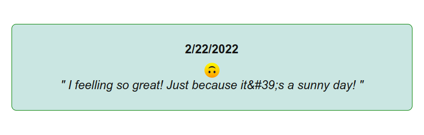

    *Solution:* Change textContent to innerHTML.

      ```javascript
        document.querySelector(".note__container--text").innerHTML = `" ${getNote} "`;
      ```
### Known Bugs

None

---
## Credits

* [Pete Docter](https://en.wikipedia.org/wiki/Pete_Docter) for creating such a wonderful film "Inside Out", which inspired us to choose the main characters from his creation as main theme of our project.
* [ColorSpace](https://mycolor.space/?hex=%230494EC&sub=1) for providing a myriad of color scheme to choose from as we did;
* [Code And Create channel](https://www.youtube.com/watch?v=o1yMqPyYeAo&t=1299s0) for givind us the inspiration to use single month calendar representation in this project;
* [pngfind](https://pngfind.com/) for providing a myriad of images to choose from as we did;
* [Render](https://render.com/) for providing a platform to host our website;
* [MongoDB](https://www.mongodb.com/) for providing a database to store our data;
* [CODE INSTITUTE](https://codeinstitute.net/) for organizing such event like HACKATHONS where students are encourage to learn and grow;
* [GitHub](https://github.com/) for providing a platform to host our repository and to collaborate with other developers; 

---
### Collaborators

Team Inside Out members of the January Hackathon 2022:
* Iuliia Konovalova:
  - [GitHub](https://github.com/IuliiaKonovalova)
  - [LinkedIn](https://www.linkedin.com/in/iuliiakonovalova/)
* Aws Sabah Gheni:
  - [GitHub](https://github.com/AwsSG)
  - [LinkedIn](https://www.linkedin.com/in/aws-al-adhami/)

* Kera Cudmore:
  - [GitHub](https://github.com/kera-cudmore)
  - [LinkedIn](https://www.linkedin.com/in/keracudmore/)
* Theo Wright:
  - [GitHub](https://github.com/theopmw)
  - [LinkedIn](https://www.linkedin.com/in/theowrightlondon/)
* Anna:
  - [GitHub](https://github.com/ANNAhabANNA)
  - [LinkedIn](https://www.linkedin.com/in/anna-k-b182b445/)

---
### Acknowledgments

We would like to acknowledge the following people who helped us along the way in completing this project:

* [Dave Bowers](https://github.com/dnlbowers), our hackathon facilitator.
* [CODE INSTITUTE](https://codeinstitute.net/), our event organizer.
* [Trust in SODA](https://www.linkedin.com/company/trust-in-soda/), our event organizer.
* Our families - for their patience and support while we disappeared for another long weekend of coding.
