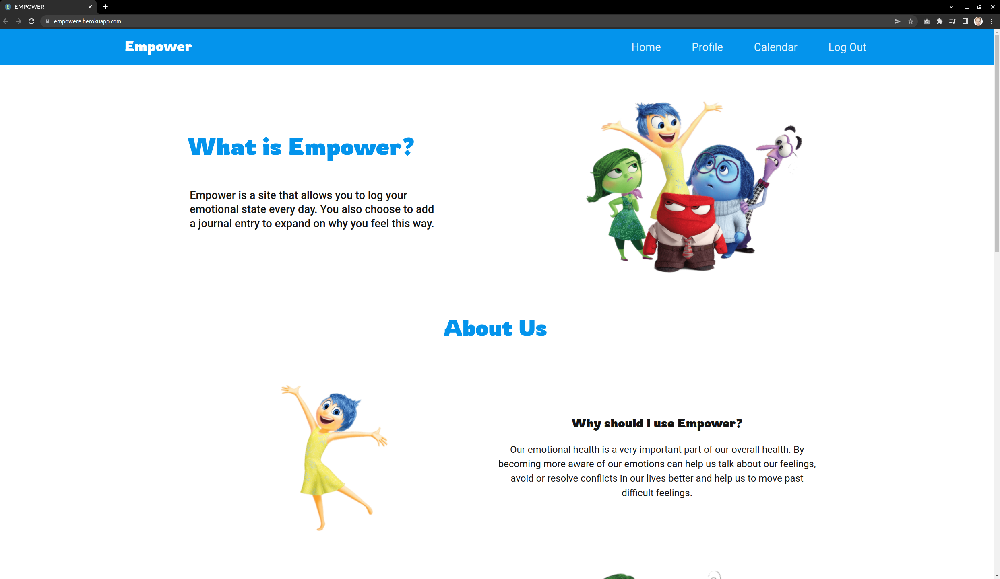
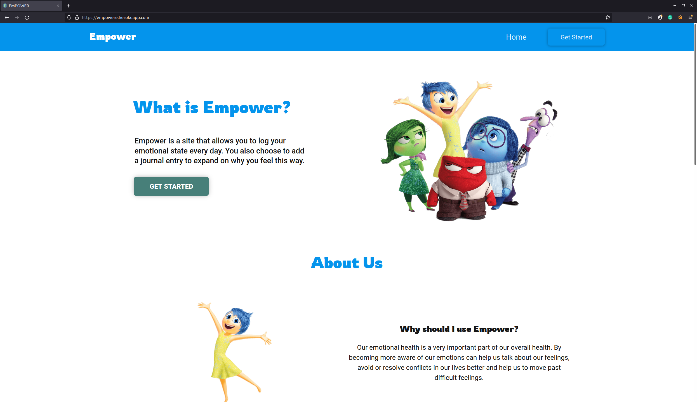
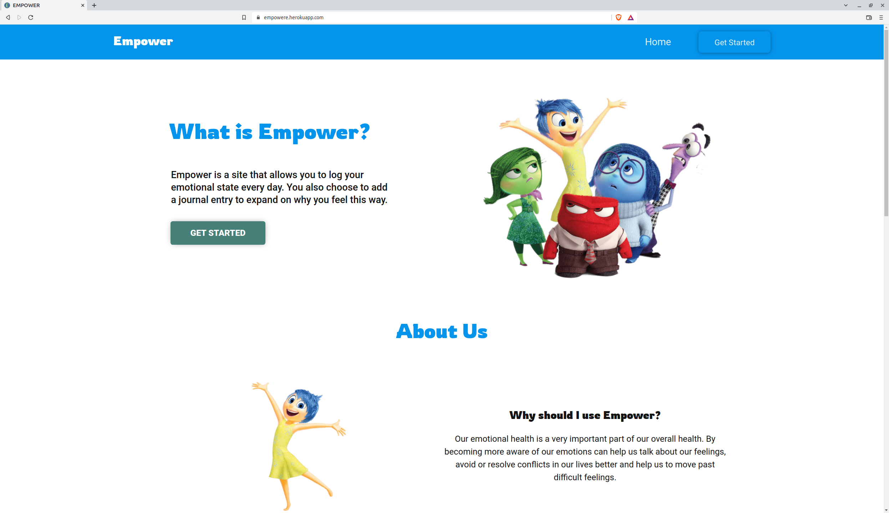

## **Contents**

* [**Testing**](#testing)
  * [**Navigation**](#navigation)
  * [**Advent Calendar Door**](#advent-calendar-door)
  * [**Pop Up Box Puzzle Instructions**](#pop-up-box-puzzle-instructions)
  * [**Github image links**](#github-image-links)
  * [**Github image links**](#github-image-links)
  * [**Validator testing**](#Validator-testing)
    * [**HTML Validation**](#HTML-Validation)
    * [**CSS Validation**](#CSS-Validation)
    * [**JS Validation**](#JS-Validation)
  * [**Lighthouse report**](#Lighthouse-Report)
  * [**Compatibility**](#Compatibility)
  * [**Responsiveness**](#Responsiveness)
  * [**Functionality**](#Functionality)

# **Testing**

### **Navigation** 

| Feature      | Expected          | Testing  | Result | Pass/Fail |
|-------------|-------------|-----|----------|:----:|
| Code-Vent Calendar Page Title | To redirect to home page | Clicked Code-Vent Calendar Page Title | Title navigates to home page | Pass |

[Back to contents](#contents)

---

## Validator testing

### HTML Validation

- No errors or warnings were found when passing through the official [W3C](https://validator.w3.org/) validator except jinja syntax.

    - Home page:
* [HTML](https://validator.w3.org/nu/#textarea)

    - Log In page:
* [HTML](https://validator.w3.org/nu/#textarea)

    - Register page:
* [HTML](https://validator.w3.org/nu/#textarea)

    - Profile page:
* [HTML](https://validator.w3.org/nu/#textarea)

    - Calendar page:
* [HTML](https://validator.w3.org/nu/#textarea)

### CSS Validation

- No errors were found when passing through the official [W3C (Jigsaw)](https://jigsaw.w3.org/css-validator/#validate_by_uri) validator: 
    * [CSS](https://jigsaw.w3.org/css-validator/validator?uri=https%3A%2F%2Fmanni8436.github.io%2Fhackvent-calendar%2F&profile=css3svg&usermedium=all&warning=1&vextwarning=&lang=en)
- The CSS validator shows the multiple warning regardless the use of webkit and clip property. However, everything works perfectly well without any issues.

### JS Validation
*  js files were checked by the official [JSHint](https://jshint.com/):
    * [script.js](documentation/testing/testing_hintjs_script.png);
    * [calendar.js](documentation/testing/testing_hintjs_calendar.png);

### Python Validation
Valentin Bryukhanov's [online validation tool](http://pep8online.com/) was used to ensure that all of the project's Python source code is [Pep 8-compliant](https://legacy.python.org/dev/peps/pep-0008/). This checking was done manually by copying python code and pasting it into the validator.

No errors were found:

- **app.py**

## Lighthouse Report

## Compatibility:

+ The app was tested on the following browsers: Chrome, Firefox, Brave, Edge:

  - Chrome:

  
  
  - Firefox:

  

  - Safari:

  
## Responsiveness:

+ The app was checked with [Responsive Website Design Tester](https://responsivedesignchecker.com/).

  1. Mobile Screens:

    - Mobile 320x480, 320x568, 360x640, 375x667, 384x640, 411x731, 414x736:

     

      
  1. Tablets Screens:

    - Tablet 600x960, 768x1024, 800x1280, 1366x1024, 1600x900, 1680x1050, 1920x1080, 1920x1200:
        
    
      
  1. Desktop Screens:

    - Desktop 1024x600, 1024x800, 1366x768, 1440x900:
        
    

## Functionality:

The functionality of the links in the app was checked as well by different users.

 