## **Contents**

* [**Testing**](#testing)
* [**Advent Calendar Door**](#advent-calendar-door)
* [**Pop Up Box Puzzle Instructions**](#pop-up-box-puzzle-instructions)
* [**Github image links**](#github-image-links)
* [**Github image links**](#github-image-links)
* [**Validator testing**](#Validator-testing)
  * [**HTML Validation**](#HTML-Validation)
  * [**CSS Validation**](#CSS-Validation)
  * [**JS Validation**](#JS-Validation)
* [**Lighthouse report**](#Lighthouse-Report)
* [**Compatibility**](#Compatibility)
* [**Responsiveness**](#Responsiveness)
* [**Functionality**](#Functionality)

# **Testing**

Usability was tested with the below user acceptance testing, sent to new users to ensure testing from different users, on different devices and browsers to ensure issues were caught and where possible fixed during development.

|             | User Action | Expected result  | Y/N | Comment |
|-------------|-------------|------------------|-----|---------|
|Sign Up      |             |                  |     |         |
|1            | Click GET STARTED button in home page | Sign up page | Y | Sign up page opens |
|2            | Click on GET STARTED from navbar | Dropdown menu with 2 options login/signUp | Y | User will choose between 2 options |
|3            | Click on REGISTER from navbar in dropdown menu| Register Page | Y | Register page opens |
|4            | Enter valid username and password | Profile page | Y | User is signed up |
|5            | Enter valid username and password | Profile page | Y | User is logged in |
|6            | Click login link | LogIn page | Y | User will be redirected to logIn page |
| Log In      |             |                  |     |         |
|1            | Click on GET STARTED button in home page | Sign up page | Y | Sign up page opens |
|2            | Click on login from dropdown menu | Login page | Y | Login page opens |
|3            | Enter valid username and password | Profile page | Y | User is signed up |
|4            | Click Register link | Register page | Y | User will be redirected to Register page |
|Log Out      |             |                  |     |         |
|1            | Click on logout button | Home page | Y | User is logged out |
|2            | Click browser back button | You are still logged out | Y | session is ended |
|Footer Links  |             |                  |     |         |
|1            | Click on Aws Sabah Gheni | Github page | Y | Aws Sabah Gheni page opens |
|2            | Click on Iuliia Konovalova | Github page | Y | Iuliia Konovalova page opens |   
|3            | Click on Kera Cudmore | Github page | Y | Kera Cudmore page opens |
|4            | Click on Theo Wright | Github page | Y | Theo Wright page opens |   
|5            | Click on Anna | Github page | Y | Aws Sabah Gheni page opens |
|6            | Click on Link to GitHub repository | Github page | Y | Project repository page opens |
|Profile Page |             |                  |     |         |
|1            | Click on info icon | Modal window | Y | Modal window opens with the instructions |
|2            | Click on close icon | Profile Page | Y | Modal window closes |
|3            | Click on outside of the modal window | Profile page | Y | Modal window closes |
|4            | Click on any emoji | Note box | Y | Note box opens under emojis container |
|5            | Type text in note box | Text in note box | Y | User will see notes until he/she hits add not button |
|6            | Click on add note button | Profile page with suggestions | Y | User will have no chance to add any emoji or note for this day |
|7            | Click on LogOut | Home page | Y | User logged out |
|8            | Click on logIn | Home page | Y | User logged out |
|9            | Click on GET STARTED button in home page | Sign up page | Y | Sign up page opens |
|10           | Click on login from dropdown menu | Login page | Y | Login page opens |
|11           | Enter valid username and password | Profile page | Y | User is signed up |
|12           | Click on links in suggestions box | new window opens | Y | Another window will opens with recommended website |
|13           | Click on VIEW EMOTIONAL HISTORY button | Calendar Page | Y | User will be redirect to Calendar Page |
|Calendar Page |             |                  |     |         |
|1            | Click on CALENDAR button | Calendar page | Y | User will be redirect to Calendar Page |
|2            | Click on any day in calendar  with emoji | Notes box under calendar | Y | User will see a notes box left by the user and date when the notes were left. If user did not add any notes but left only emoji, user would see phrase "You didn't write anything for this day." |
|3            | Click on any day in calendar without emoji | - | Y | As user didn't make any entries on this day, nothing was recorded. |
|4            | Click on **<** button in calendar's header | Month before in calendar | Y | User will see the previous month in the calendar |
|5            | Click on **>** button in calendar's header | Month after in calendar | Y | User will see the next month in the calendar |

[Back to contents](#contents)

---

## Validator testing

### HTML Validation

- No errors or warnings were found when passing through the official [W3C](https://validator.w3.org/) validator for the following pages:

    - Home page:
* 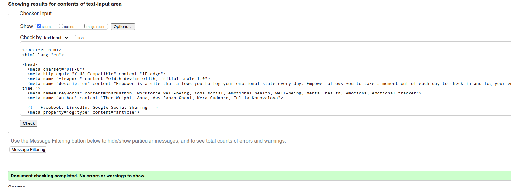

    - Log In page:
* 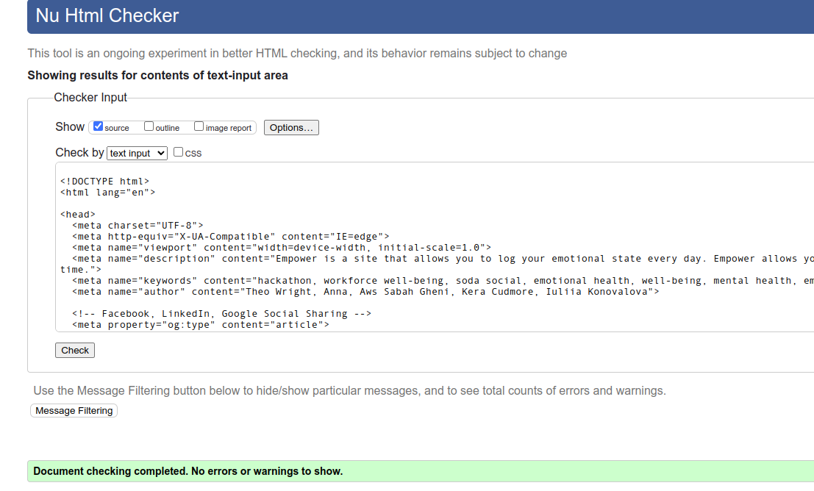

    - Register page:
* 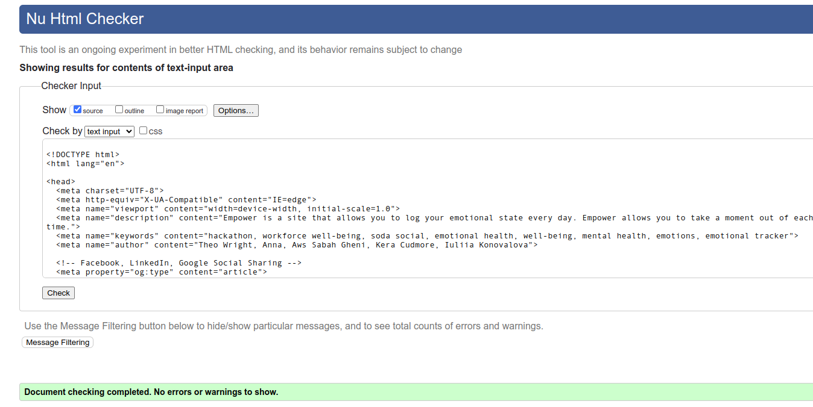

    - Profile page:
* 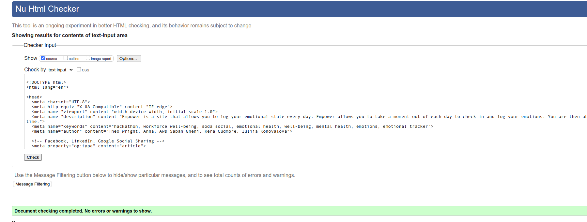

    - Calendar page:
* 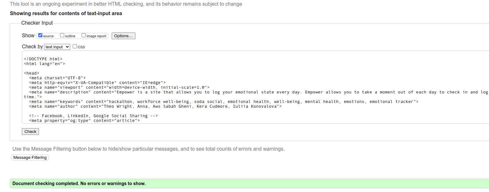

### CSS Validation

- No errors were found when passing through the official [W3C (Jigsaw)](https://jigsaw.w3.org/css-validator/#validate_by_uri) validator: 
    * 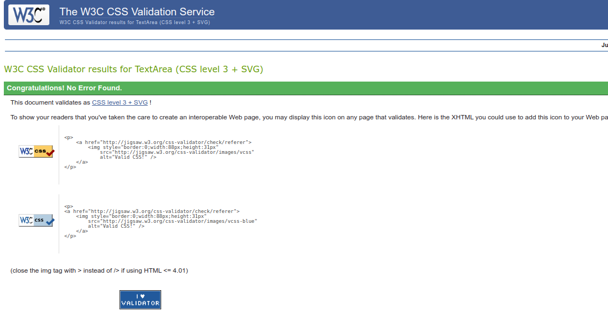
- The CSS validator shows the multiple warning regardless the use of webkit and clip property. However, everything works perfectly well without any issues.

### JS Validation
*  js files were checked by the official [JSHint](https://jshint.com/):
    * [script.js](documentation/testing/testing_hintjs_script.png);
    * [calendar.js](documentation/testing/testing_hintjs_calendar.png);
Variables, which reported to be undefined were defined in template since they are needed to be received by the template.

### Python Validation
Valentin Bryukhanov's [online validation tool](http://pep8online.com/) was used to ensure that all of the project's Python source code is [Pep 8-compliant](https://legacy.python.org/dev/peps/pep-0008/). This checking was done manually by copying python code and pasting it into the validator.

No errors were found:

- **app.py**

## Lighthouse Report

- Home Page:
    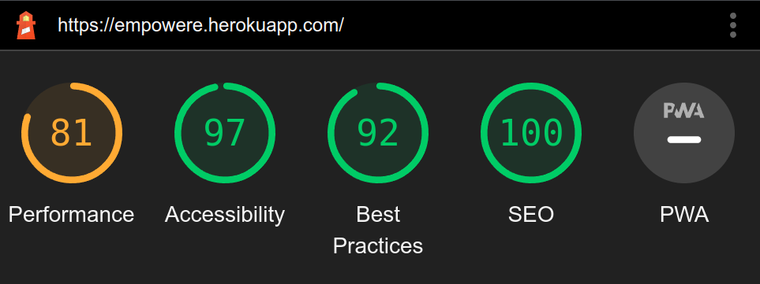

- Log In Page:
    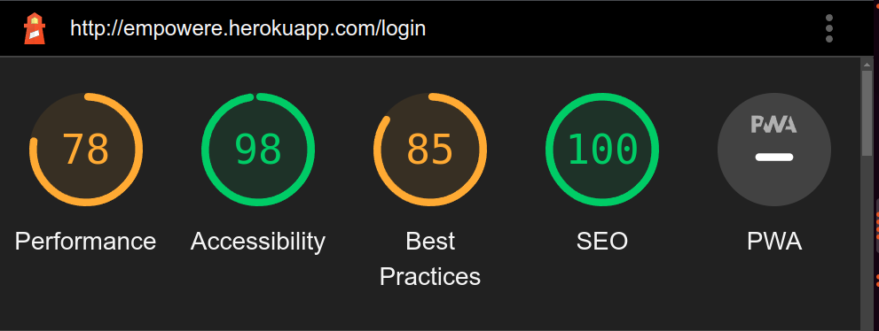

- Register Page:
    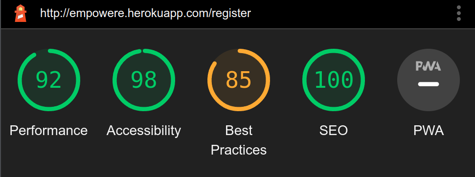

- Profile Page:
    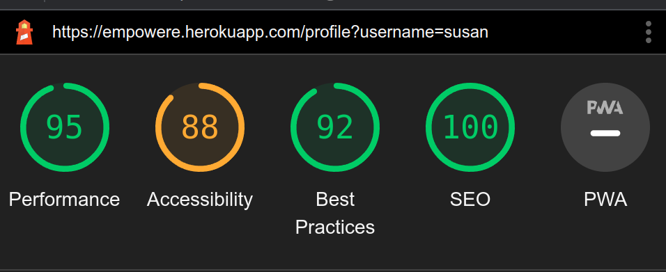

- Calendar Page:
    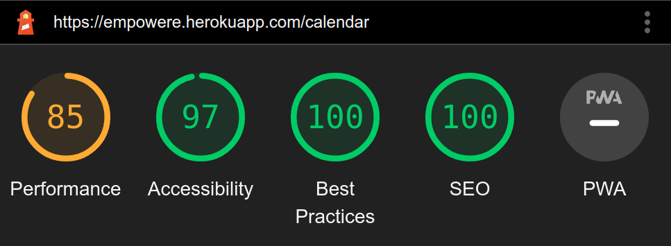
## Compatibility:

+ The app was tested on the following browsers: Chrome, Firefox, Brave, Edge:

  - Chrome:

  
  
  - Firefox:

  

  - Brave:

  
  

## Responsiveness:

+ The app was checked with [Responsive Website Design Tester](https://responsivedesignchecker.com/).

  1. Mobile Screens:

    - Mobile 320x480, 320x568, 360x640, 375x667, 384x640, 411x731, 414x736:

     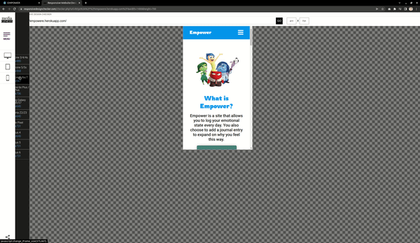

      
  1. Tablets Screens:

    - Tablet 600x960, 768x1024, 800x1280, 1366x1024, 1600x900, 1680x1050, 1920x1080, 1920x1200:
        
    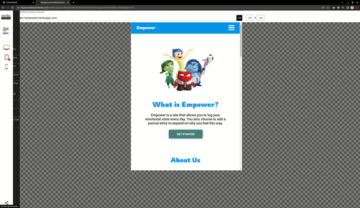
      
  1. Desktop Screens:

    - Desktop 1024x600, 1024x800, 1366x768, 1440x900:
        
    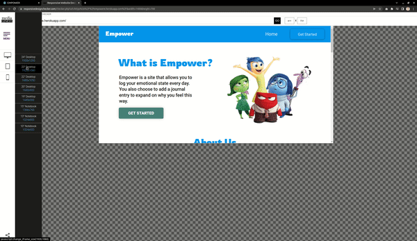

## Functionality:

The functionality of the links in the app was checked as well by different users.

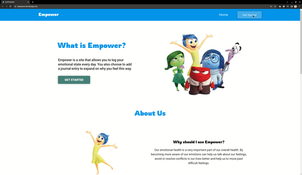

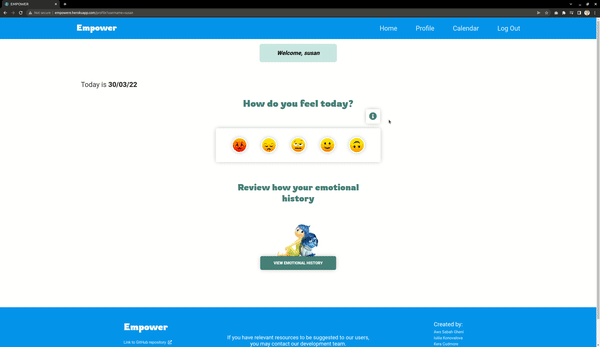